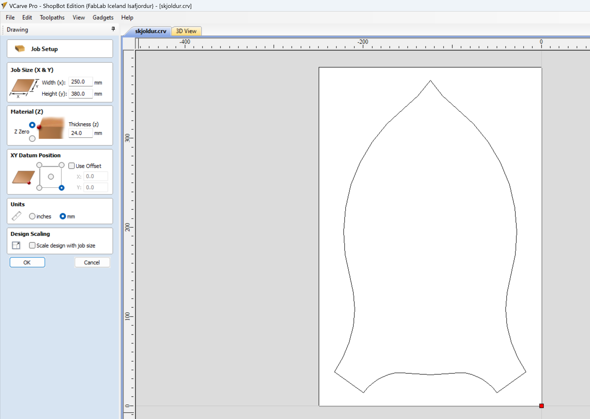

# Milling
In the preparation course I will use VCarve and the Shopbot to practice milling fabrication. 

The [tutorial](https://www.youtube.com/watch?v=pGVNDf1vgSI) recommended by my supervisor includes all important information. 

## The workpiece
As I wanted to make something I would actually use, I decided on making a trophy shield. 

I drew the outline in a sketch in Fusion 360, as I'm most familiar with that environment. Then I saved the sketch as a *.dxf file. 

Next I looked for scrap wood that is large enough. I found a piece of 12mm birch plywood that I could cut in half and glue together to double the thickness. 

## VCarve
I did the *Job Setup* and imported the dxf-file. Then I needed to align it to the center of the workpiece and mirror it to get the other half and delete some unwanted lines. 

Next I joined the open vectors and created an inwards offset to get another path for some more engraving operations. (Later I realized, that it is very easy to select the offset in the toolpath operation as well). 

Then it's time for the toolpaths. 
I used the *2D Profile Toolpath* for both the cutting and engraving operations, because I don't like, that the *Quick Engraving Toolpath* doesn't offer the ramp function. 
I selected a 1/2'' straight end mill for the cutting and a 90° engraving bit for the engraving. 

## Bonus
I decided to add a custom form tool to make the outer edge looking more nice. The only advantage of adding the custom tool is, that the preview will look as the real workpiece and it's easier to identify possible mistakes, otherwise you could use a normal milling bit in VCarve and put the form bit in the shopbot, if you know what you're doing. 

I needed to draw the right side profile of the milling bit and with the profile selected wnet into the *Tool Library* and defined a new tool. 

Then I added another *2D Profile Toolpath* with an offset for the edge forming, using the new form tool. The resulting toolparts and machining preview look like this: 

Lastly, I saved the toolpaths into one *.sbp file. 

## Shopbot

