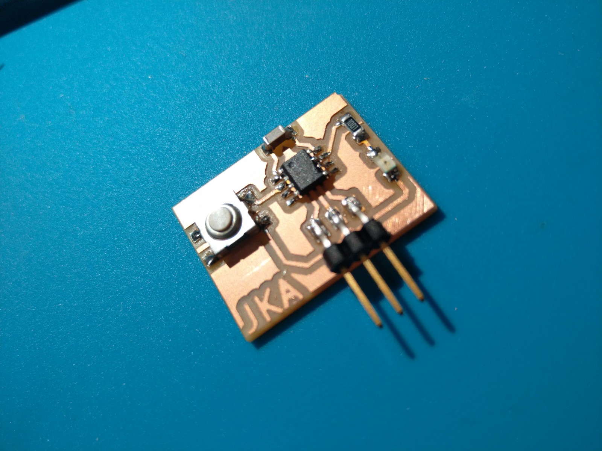

# PCB

When learning how to make a PCB I followed the tutorial on the [FabÍsa-Homepage](https://www.fabisa.is/N%C3%A1msefni/Pre-Fab/2-rafrasasmidi/). 

Setting up KiCAD and InkScape, drawing the schematics, designing the PCB and transforming everything into a png-image was pretty straight forward. 

When saving the traces and cut images, remember to set the resolution to 1000px. My Inkscape resets itself to some lower value. 

[PCB_traces.png](../pre-fab/attiny_trace.png)
[PCB_cut.png](../pre-fab/attiny_cut.png)

## Milling of the PCB

Before milling you have to start the terminal for the connection to the milling machine and open the website. 

The machine has to be turned on and set to machining mode by pressing the "view" button. 

Attention: The X/Y Zero is not where you would expect it (in the lower left corner of the plate). There is an offset of about -30/-30 to it. 

Before abjusting z-zero - put the milling bit into the collet - move the spindle above the plate and lower the z-axis with the arrow buttons. Loosen the stop-screw of the collet again and drop the bit the las few millimeters. 

Typical speed is 4mm/s and cutting depth for the traces 0.1mm. 

The bit I used was a bit dull, so the cuts were not as clean as possible. A bit of 800grid wet sandpaper helps to smoothen it.  

After soldering the components on the PCB it looks quite okay, but does it work?

