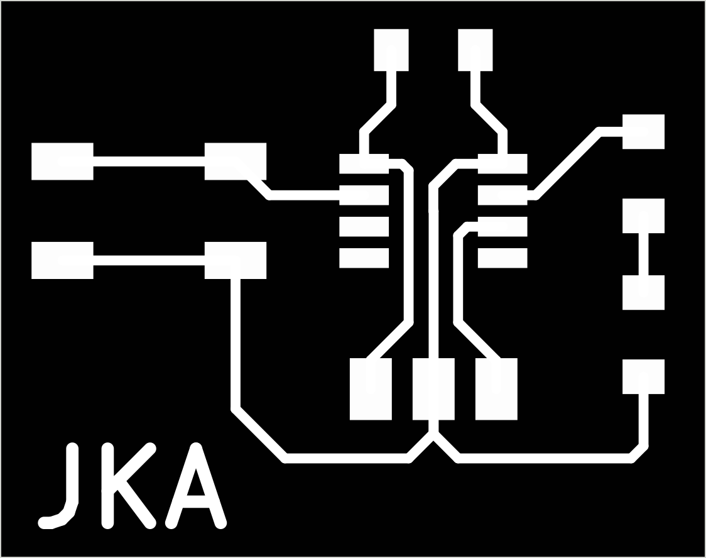
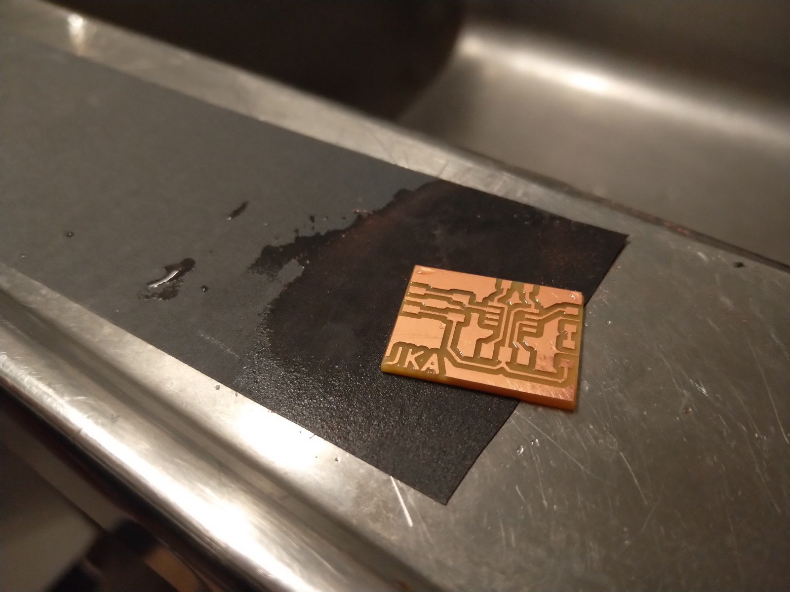
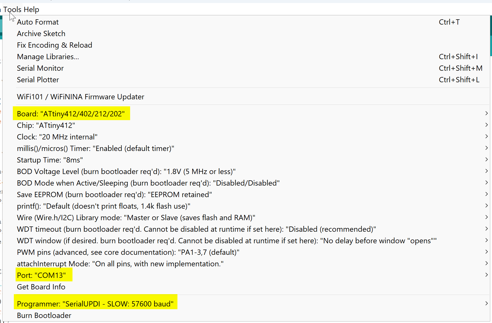

# PCB

When learning how to make a PCB I followed the tutorial on the [FabÍsa-Homepage](https://www.fabisa.is/N%C3%A1msefni/Pre-Fab/2-rafrasasmidi/). 

Setting up KiCAD and InkScape, drawing the schematics, designing the PCB and transforming everything into a png-image was pretty straight forward. 

When saving the traces and cut images, remember to set the resolution to 1000px. My Inkscape resets itself to some lower value. 




## Milling of the PCB

Before milling you have to start the terminal for the connection to the milling machine and open the website. 

The machine has to be turned on and set to machining mode by pressing the "view" button. 

Attention: The X/Y Zero is not where you would expect it (in the lower left corner of the plate). There is an offset of about -30/-30 to it. 

Before abjusting z-zero - put the milling bit into the collet - move the spindle above the plate and lower the z-axis with the arrow buttons. Loosen the stop-screw of the collet again and drop the bit the las few millimeters. 

Typical speed is 4mm/s and cutting depth for the traces 0.1mm. 


The bit I used was a bit dull, so the cuts were not as clean as possible. A bit of 800grid wet sandpaper helps to smoothen it.  



After soldering the components on the PCB it looks quite okay, but does it work?


## Programming the attiny

I used the Arduino IDE to write a program. 

To actually being able to connect and program the Attiny a special UDPI programmer is needed. I got one from my instructor and it plugs into the USB-port and appears as a Serial Device. 


Then I needed to add the *megatinycore* board library in the board manager and select the Attiny 412 board, as well as the COM-Port of the programmer and the type of the programmer. 


It is important to realise, that the UPDI pin doesn't support a serial connection, so the serial monitor is not available for troubleshooting in the Arduino IDE. 

After a lot of debugging using the led I managed to have the program running and behaving as expected. 


Here is the [sketch](../pre-fab/pcb_blink/pcb_blink.ino): 

```
//Defining which pin to use for LED and button
#define LED 4
#define BUTTON 0

//Variable to count number of button press
int cnt = 0;
//Timer before executing the blink
int cntpause = 0;

void setup() { 
  pinMode(LED, OUTPUT);
  pinMode(BUTTON, INPUT_PULLUP);
}

void loop() { 
  //Check if Button is pressed -> counter +1
  if(digitalRead(BUTTON) == LOW){
    cnt++;  
    cntpause=0;
    while(digitalRead(BUTTON) == LOW){
      //wait
    }
    digitalWrite(LED, HIGH);
    delay(50);
    digitalWrite(LED, LOW);
    delay(50);      
  //Check if button has been pressed at least once and if timer has reached 200 -> then start blink
  }else if(cnt > 0 && cntpause > 200){
    for(int i = 0; cnt > i; i++){
      digitalWrite(LED, HIGH);
      delay(500);
      digitalWrite(LED, LOW);
      delay(500);     
    }
    //reset counter and timer
    cntpause=0;
    cnt=0;
  //Check if button has been pressed at least once and increase timer counter by 10ms
  }else if(cnt > 0){
    cntpause++;
    delay(10);
  }

}
```